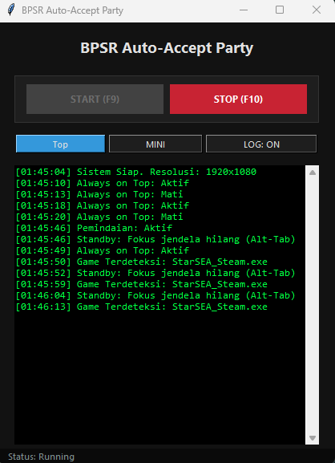
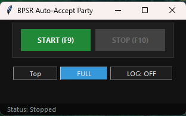
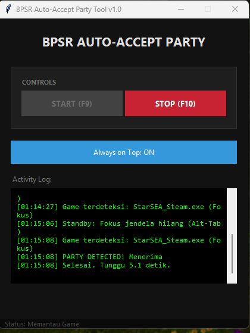

# BPSR Auto-Accept Party Tool (eksperimental)

**Bahasa Indonesia** / [English](README.md)

Alat bantu otomatisasi ringan dengan antarmuka modern (**Dark Mode**) untuk menerima permintaan party secara otomatis di **Blue Protocol: Star Resonance**.

> **Catatan:** Dioptimalkan untuk klien Steam (`StarSEA_Steam.exe`). Gunakan dengan risiko Anda sendiri.

Alat ini dirancang untuk memudahkan pemain menerima permintaan party secara otomatis saat fokus pada layar permainan, menggunakan deteksi gambar yang efisien.

### Cara Penggunaan
1. Setelah mengkompilasi kode menjadi file yang dapat dieksekusi (atau cukup jalankan kode python di folder tertentu, jika Anda tahu caranya), jangan lupa untuk menambahkan gambar yang akan dideteksi, seperti "party_apply.png" di folder yang sama.
2. Jalankan kode atau aplikasi seperti biasa.

### 📸 Pratinjau Antarmuka
| Mode Penuh (Aktif) | Mode Mini | Terdeteksi |
|---|---|---|
|  |  |  |

Beberapa gambar diambil pada versi sebelumnya, tetapi fungsinya tetap sama.

### ✨ Fitur Unggulan
- **Full Dark Mode**: Tema gelap "Midnight Stealth", nyaman di mata untuk sesi gaming yang lama.
- **Modular UI**: Pindah ke **Mode Mini** untuk tampilan yang sangat ringkas di pojok layar Anda.
- **Log Toggle**: Tampilkan atau sembunyikan log aktivitas deteksi sesuai kebutuhan.
- **Focus Awareness**: Skrip hanya akan memindai layar jika jendela game (`StarSEA_Steam.exe`) sedang aktif. Otomatis masuk ke mode **Standby** saat Anda melakukan Alt-Tab.
- **Top Toggle**: Tombol "**Top**" untuk menjaga jendela aplikasi tetap melayang di atas jendela game.
- **Optimasi Performa**: Penggunaan CPU yang rendah melalui logika pemindaian adaptif.

### 🛠️ Panduan Instalasi & Build
1. Instal [Python 3.10+](https://www.python.org/downloads/).
2. Unduh repositori ini dan buka terminal/CMD di folder proyek.
3. Instal pustaka (library) yang diperlukan:
   ```bash
   pip install -r requirements.txt
